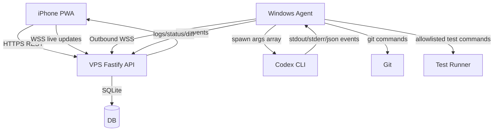
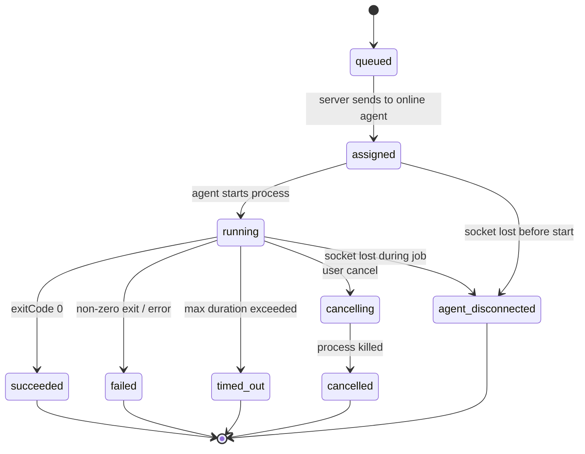

# SDD: Codex Mobile Controller

**Документ:** Software Design Document / ТЗ для реализации  
**Версия:** 1.0  
**Дата:** 2026-05-15  
**Целевая платформа:** iPhone / iOS Safari PWA → VPS с белым IP → домашний Windows-ПК → Codex CLI  
**Целевой исполнитель:** Codex CLI / разработчик  
**Рабочее название проекта:** `codex-mobile-controller`

---

## 0. Инструкция для Codex

Codex, реализуй проект по этому SDD как рабочий MVP, не как псевдокод. Если встречается неоднозначность, выбирай безопасный и простой вариант, фиксируй решение в `docs/DECISIONS.md` и продолжай. Не открывай inbound-порты на домашнем Windows-ПК. Домашний ПК должен сам подключаться к VPS исходящим WebSocket-соединением. Телефон должен работать через HTTPS/WSS на VPS.

Главная цель: дать владельцу возможность с iPhone удобно запускать Codex-задачи на домашнем Windows-ПК, смотреть live logs, статус, git diff, результаты тестов и отменять задачи.

---

## 1. Краткое описание системы

Система состоит из трёх основных частей:

```text
iPhone Safari / PWA
        ↓ HTTPS + WSS
VPS с белым IP: Web UI + API + WebSocket broker + SQLite DB
        ↓ исходящее WSS-соединение от домашнего ПК
Windows Agent на домашнем ПК
        ↓ spawn безопасных команд
Codex CLI / Git / тесты / PowerShell
```

Пользователь открывает PWA на iPhone, логинится, выбирает репозиторий, пишет задачу, нажимает `Run Codex`. Сервер кладёт job в очередь и отправляет её подключённому Windows Agent. Agent запускает `codex exec` в выбранном allowlisted-репозитории, стримит stdout/stderr обратно на VPS, а UI показывает live logs. После завершения Agent собирает `git status --short`, `git diff`, опционально запускает тесты из allowlist и отдаёт результат в UI.

---

## 2. Цели

### 2.1. Основные цели MVP

1. Управлять домашним Windows-ПК с iPhone без открытия портов на домашнем ПК.
2. Запускать Codex CLI задачи в выбранном локальном репозитории.
3. Стримить логи Codex в мобильный интерфейс в реальном времени.
4. Показывать состояние машины: online/offline, hostname, версия агента, последняя активность.
5. Показывать список allowlisted-репозиториев: имя, путь, ветка, dirty status.
6. Поддерживать sandbox-режимы Codex: `read-only`, `workspace-write`; `danger-full-access` запрещён в MVP.
7. Показывать git diff и git status после выполнения задачи.
8. Позволять отменить running job.
9. Хранить историю задач, prompt, статус, логи и audit events.
10. Иметь mobile-first UI, устанавливаемый как PWA на iOS.

### 2.2. Не цели MVP

1. Не реализовывать полноценный web terminal с arbitrary shell.
2. Не открывать RDP, SSH или Codex app-server напрямую в интернет.
3. Не реализовывать multi-user SaaS.
4. Не реализовывать full GitHub PR workflow в первом MVP.
5. Не использовать `--dangerously-bypass-approvals-and-sandbox` / `--yolo`.
6. Не пытаться реализовать официальный протокол Codex App как основной путь.
7. Не выполнять произвольные команды, введённые пользователем в UI.

---

## 3. Архитектурные принципы

1. **Домашний ПК всегда client, не server.** Windows Agent сам подключается к VPS через исходящий WSS.
2. **VPS — control plane.** Он хранит jobs, logs, users, agent status, audit.
3. **Agent — execution plane.** Только агент на Windows имеет доступ к локальным репозиториям и запускает Codex/Git/тесты.
4. **Allowlist вместо arbitrary shell.** UI не должен давать пользователю выполнить любой shell command.
5. **Минимальные права.** Агент работает от отдельного Windows-пользователя, не от Administrator.
6. **Каждая задача должна быть воспроизводима.** Хранить prompt, repo, branch, sandbox, команду запуска, exit code, логи, diff summary.
7. **Mobile-first UX.** Интерфейс должен быть удобен на iPhone: крупные кнопки, sticky action bar, readable logs, dark mode.
8. **Security by default.** HTTPS only, WSS only, HttpOnly cookies, CSRF, rate limits, hashed agent tokens, audit log.

---

## 4. Технологический стек

### 4.1. Monorepo

- Package manager: `pnpm`
- Language: TypeScript
- Monorepo layout: pnpm workspaces

```text
codex-mobile-controller/
  apps/
    web/
    server/
    agent-windows/
  packages/
    shared/
    protocol/
    ui/
  docs/
  scripts/
  infra/
  package.json
  pnpm-workspace.yaml
  README.md
```

### 4.2. Frontend

- Next.js App Router
- React
- Tailwind CSS
- shadcn/ui или собственные компоненты на Radix UI
- PWA manifest + service worker
- WebSocket или SSE для live logs; предпочтительно WebSocket
- Mobile-first layout

### 4.3. Backend на VPS

- Node.js TypeScript
- Fastify
- `@fastify/websocket`
- SQLite для MVP
- Prisma ORM или Drizzle ORM; выбрать один и зафиксировать в `docs/DECISIONS.md`
- Zod для runtime validation
- Argon2id или bcrypt для password hash; предпочтительно Argon2id
- Caddy или Nginx как reverse proxy с TLS

### 4.4. Windows Agent

- Node.js TypeScript CLI-приложение
- `child_process.spawn` без shell interpolation
- Конфиг-файл агента: `agent.config.json`
- Автозапуск через Windows Task Scheduler или Windows Service wrapper
- Reconnect/backoff для WSS
- Heartbeat каждые 15–30 секунд
- Graceful shutdown и job cancellation

### 4.5. Runtime tools на Windows

- Codex CLI
- Git
- Node.js / pnpm / npm / yarn по проекту
- PowerShell 7 желательно, но MVP должен работать и с Windows PowerShell, если команды простые

---

## 5. Развёртывание

### 5.1. VPS

VPS имеет белый IP и домен, например:

```text
codex.example.com
```

Открытые порты на VPS:

```text
80/tcp   только для ACME/redirect на HTTPS
443/tcp  HTTPS + WSS
22/tcp   SSH admin, желательно ограничить по IP/VPN
```

Опционально WireGuard для админского доступа:

```text
51820/udp WireGuard
```

### 5.2. Windows home PC

Домашний ПК не имеет публичных inbound-портов. Он делает исходящее подключение:

```text
wss://codex.example.com/api/agent/ws
```

### 5.3. iPhone

Пользователь открывает:

```text
https://codex.example.com
```

и устанавливает PWA через Safari → Share → Add to Home Screen.

---

## 6. High-level diagram



---

## 7. Пользовательские сценарии

### 7.1. Запуск Codex-задачи с iPhone

1. Пользователь открывает PWA.
2. Видит статус `Home PC: Online`.
3. Выбирает репозиторий.
4. Вводит prompt.
5. Выбирает sandbox: `read-only` или `workspace-write`.
6. Нажимает `Run Codex`.
7. UI открывает страницу job detail.
8. Логи Codex появляются live.
9. После завершения отображаются:
   - итоговый статус;
   - final message;
   - git status;
   - git diff;
   - exit code;
   - duration.

### 7.2. Быстрый шаблон задачи

UI должен содержать быстрые chips:

```text
Почини тесты
Сделай ревью
Сверстай страницу
Найди баг
Объясни архитектуру
Сделай рефакторинг минимально
Добавь тесты
```

При нажатии chip prompt textarea заполняется шаблоном, который пользователь может отредактировать.

### 7.3. Отмена задачи

1. Пользователь нажимает `Stop`.
2. Server отправляет `job.cancel` агенту.
3. Agent завершает процесс Codex:
   - сначала graceful signal;
   - затем kill tree после timeout.
4. Job получает статус `cancelled`.
5. UI показывает partial logs и partial diff, если он доступен.

### 7.4. Запуск тестов после изменений

1. На странице job пользователь нажимает `Run tests`.
2. UI показывает список allowlisted test commands для repo.
3. Пользователь выбирает команду.
4. Server создаёт job type `test`.
5. Agent запускает только allowlisted команду.
6. Logs и exit code отображаются live.

---

## 8. Функциональные требования

### 8.1. Authentication

MVP — single-owner system.

Требования:

- Login по email/password.
- Password hash через Argon2id или bcrypt.
- Session через HttpOnly Secure SameSite cookie.
- CSRF protection для unsafe REST методов.
- Logout.
- Rate limit на login.
- Первый пользователь создаётся через CLI seed command на сервере, не через публичную registration page.

Не делать публичную регистрацию в MVP.

### 8.2. Agent authentication

Windows Agent подключается к серверу с `agentId` и secret token.

Требования:

- В БД хранить только hash токена.
- Agent передаёт token в Authorization header при WSS upgrade.
- Server валидирует токен до принятия WebSocket.
- Токен можно rotate через server CLI/API.
- Agent не должен получать jobs для другого `agentId`.

Пример:

```http
GET /api/agent/ws HTTP/1.1
Host: codex.example.com
Authorization: Bearer cmc_agent_xxx
```

### 8.3. Machine status

Server хранит:

- `agentId`
- `hostname`
- `os`
- `agentVersion`
- `codexVersion`
- `gitVersion`
- `lastSeenAt`
- `status`: `online | offline`
- `currentJobId`

### 8.4. Repository allowlist

Agent читает локальный config:

```json
{
  "agentId": "home-windows",
  "serverUrl": "wss://codex.example.com/api/agent/ws",
  "tokenEnv": "CMC_AGENT_TOKEN",
  "heartbeatIntervalMs": 20000,
  "maxJobDurationMs": 3600000,
  "maxLogBytesPerJob": 10485760,
  "repos": [
    {
      "id": "my-app",
      "name": "My App",
      "path": "C:\\dev\\my-app",
      "defaultSandbox": "workspace-write",
      "allowedSandboxes": ["read-only", "workspace-write"],
      "testCommands": [
        {
          "id": "npm-test",
          "label": "npm test",
          "command": "npm",
          "args": ["test"],
          "timeoutMs": 900000
        },
        {
          "id": "pnpm-test",
          "label": "pnpm test",
          "command": "pnpm",
          "args": ["test"],
          "timeoutMs": 900000
        }
      ]
    }
  ]
}
```

Server не должен принимать произвольный path от UI. UI работает только с `repoId`. Agent маппит `repoId` → локальный path из allowlist.

### 8.5. Codex job

Job input:

```ts
type CodexJobInput = {
  type: 'codex';
  repoId: string;
  prompt: string;
  sandbox: 'read-only' | 'workspace-write';
  model?: string;
  branchMode?: 'none' | 'create-per-job';
  branchName?: string;
};
```

Validation:

- `prompt`: 1–20000 chars.
- `repoId`: must exist in connected agent allowlist.
- `sandbox`: must be allowed for repo.
- `model`: optional; if empty, use Codex default.
- `branchName`: sanitized, no spaces, no shell usage.

### 8.6. Codex command invocation

Agent должен формировать аргументы через array, не через строку shell.

Основная команда:

```text
codex --ask-for-approval never exec --cd <repoPath> --sandbox <sandbox> --json <prompt>
```

Если установленная версия Codex CLI не принимает global flag в такой позиции, агент должен использовать совместимый fallback и зафиксировать это в логах:

```text
codex -c approval_policy="never" exec --cd <repoPath> --sandbox <sandbox> --json <prompt>
```

Agent должен иметь capability probe при старте:

```text
codex --version
codex exec --help
```

На основании help/version агент выбирает поддерживаемую форму запуска. Запрещено использовать:

```text
--dangerously-bypass-approvals-and-sandbox
--yolo
danger-full-access
```

`read-only` используется для ревью/анализа без правок. `workspace-write` используется для задач с изменениями.

### 8.7. JSON events

Предпочтительно запускать `codex exec` с `--json`, чтобы парсить machine-readable events. Если JSON формат изменится или недоступен, агент должен fallback на plain stdout/stderr streaming.

Agent protocol должен поддерживать оба типа логов:

```ts
type JobLogEvent = {
  jobId: string;
  stream: 'stdout' | 'stderr' | 'system' | 'codex-json';
  sequence: number;
  ts: string;
  text?: string;
  json?: unknown;
};
```

### 8.8. Git status / diff

После Codex job агент запускает:

```text
git status --short
git diff --stat
git diff
```

Команды выполняются через `spawn('git', ['-C', repoPath, ...])`.

Diff должен сохраняться в БД с лимитом размера. Если diff больше лимита, сохранять:

- `diffTruncated = true`
- первые N bytes
- `git diff --stat` полностью, если он влезает

### 8.9. Branch mode

Для MVP branch mode по умолчанию:

```text
create-per-job
```

Перед запуском Codex job агент проверяет текущий git state.

Если repo dirty до запуска:

- UI должен показать предупреждение.
- Agent может всё равно запускать job, но job должен сохранить `preExistingDirty = true`.

Если branch mode `create-per-job`, агент создаёт ветку:

```text
codex/<jobId-short>-<slug>
```

Требования:

- не делать commit автоматически в MVP;
- не делать push автоматически в MVP;
- только подготовить изменения в рабочем дереве и показать diff.

### 8.10. Test job

Test job запускает только allowlisted commands из repo config.

```ts
type TestJobInput = {
  type: 'test';
  repoId: string;
  testCommandId: string;
};
```

Запрещено принимать raw command из UI.

### 8.11. Logs

Требования:

- live streaming в UI;
- sequence numbers;
- сохранение в БД;
- ограничение размера логов на job;
- auto-scroll toggle в UI;
- copy logs button;
- filter stdout/stderr/system;
- ANSI stripping или безопасный renderer.

### 8.12. Job cancellation

Agent должен хранить process handle для running job.

Cancellation steps:

1. Mark job `cancelling`.
2. Send cancel to child process.
3. Wait `cancelGraceMs`, например 5000 ms.
4. Kill process tree.
5. Mark `cancelled`.

На Windows важно убивать process tree, а не только parent process. Реализовать helper `killProcessTree(pid)` через PowerShell/Windows APIs или пакет, если безопасно.

---

## 9. Нефункциональные требования

### 9.1. Security

- HTTPS only.
- WSS only для внешнего доступа.
- CORS запрещён для неизвестных origins.
- Strict CSP на frontend.
- HttpOnly Secure SameSite cookies.
- CSRF на unsafe methods.
- Rate limits:
  - login;
  - job create;
  - WebSocket connect;
  - logs polling fallback.
- Agent token хранится в env var или Windows Credential Manager, не в git.
- Agent token в БД хранится hash-only.
- Prompt и logs считаются чувствительными данными.
- Secrets из `.env` и файлов конфигурации не печатать в логи.
- Запрещены arbitrary commands.
- Запрещён `danger-full-access` в UI и API.
- Запрещён `--yolo`.
- Audit log всех действий пользователя и агента.

### 9.2. Reliability

- Agent reconnect with exponential backoff.
- Heartbeat каждые 20 секунд.
- Server marks agent offline after 60 секунд без heartbeat.
- Jobs survive server restart.
- Если agent disconnect во время job:
  - job статус `unknown` или `agent_disconnected`;
  - после reconnect agent сообщает running/finished state, если возможно.
- Max job duration default 60 минут.
- Max log size default 10 MB на job.

### 9.3. Performance

MVP рассчитан на одного владельца и 1–3 домашних машины.

- UI должен открываться быстро на iPhone.
- Logs должны стримиться с batching/throttling, например flush каждые 200–500 ms.
- DB writes для logs делать batch insert, не один insert на каждый маленький chunk.

### 9.4. Privacy

- Не отправлять локальные файлы на VPS, кроме:
  - prompt;
  - logs;
  - git status;
  - diff;
  - metadata repo/branch.
- Не хранить полные файлы проекта на VPS.
- Добавить настройку `redactPatterns` в agent config.

Пример:

```json
{
  "redactPatterns": [
    "OPENAI_API_KEY=\\S+",
    "sk-[A-Za-z0-9_-]+",
    "ghp_[A-Za-z0-9_]+"
  ]
}
```

---

## 10. Data model

Использовать SQLite. Ниже conceptual schema. Реализовать через выбранный ORM.

### 10.1. User

```ts
type User = {
  id: string;
  email: string;
  passwordHash: string;
  createdAt: Date;
  updatedAt: Date;
  lastLoginAt?: Date;
};
```

### 10.2. Session

```ts
type Session = {
  id: string;
  userId: string;
  tokenHash: string;
  createdAt: Date;
  expiresAt: Date;
  revokedAt?: Date;
};
```

### 10.3. Agent

```ts
type Agent = {
  id: string;
  name: string;
  tokenHash: string;
  hostname?: string;
  os?: string;
  agentVersion?: string;
  codexVersion?: string;
  gitVersion?: string;
  status: 'online' | 'offline';
  lastSeenAt?: Date;
  createdAt: Date;
  updatedAt: Date;
};
```

### 10.4. Repo

Repo metadata приходит от agent allowlist и кэшируется на сервере.

```ts
type Repo = {
  id: string;
  agentId: string;
  name: string;
  pathFingerprint: string;
  defaultSandbox: 'read-only' | 'workspace-write';
  allowedSandboxesJson: string;
  currentBranch?: string;
  dirty?: boolean;
  lastScannedAt?: Date;
  createdAt: Date;
  updatedAt: Date;
};
```

Не хранить raw Windows path публично в UI, если пользователь не включил debug mode. Можно показывать masked path:

```text
C:\dev\my-app
```

### 10.5. Job

```ts
type Job = {
  id: string;
  agentId: string;
  repoId: string;
  type: 'codex' | 'test' | 'git-status';
  status:
    | 'queued'
    | 'assigned'
    | 'running'
    | 'cancelling'
    | 'cancelled'
    | 'succeeded'
    | 'failed'
    | 'timed_out'
    | 'agent_disconnected';
  prompt?: string;
  sandbox?: 'read-only' | 'workspace-write';
  testCommandId?: string;
  branchName?: string;
  preExistingDirty?: boolean;
  exitCode?: number;
  errorMessage?: string;
  finalMessage?: string;
  diffStat?: string;
  diffText?: string;
  diffTruncated: boolean;
  createdByUserId: string;
  createdAt: Date;
  assignedAt?: Date;
  startedAt?: Date;
  finishedAt?: Date;
  updatedAt: Date;
};
```

### 10.6. JobLog

```ts
type JobLog = {
  id: string;
  jobId: string;
  sequence: number;
  stream: 'stdout' | 'stderr' | 'system' | 'codex-json';
  text?: string;
  jsonText?: string;
  createdAt: Date;
};
```

### 10.7. AuditEvent

```ts
type AuditEvent = {
  id: string;
  actorType: 'user' | 'agent' | 'system';
  actorId?: string;
  action: string;
  targetType?: string;
  targetId?: string;
  ip?: string;
  userAgent?: string;
  metadataJson?: string;
  createdAt: Date;
};
```

---

## 11. API design

Все REST endpoints начинаются с `/api`.

### 11.1. Auth API

```http
POST /api/auth/login
POST /api/auth/logout
GET  /api/auth/me
```

`POST /api/auth/login` body:

```json
{
  "email": "owner@example.com",
  "password": "..."
}
```

Response:

```json
{
  "user": {
    "id": "usr_...",
    "email": "owner@example.com"
  }
}
```

### 11.2. Machine / Agent API

```http
GET /api/agents
GET /api/agents/:agentId
GET /api/agents/:agentId/repos
POST /api/agents/:agentId/refresh
```

`refresh` создаёт internal job `git-status` или отправляет agent request `repo.scan`.

### 11.3. Jobs API

```http
GET    /api/jobs
POST   /api/jobs
GET    /api/jobs/:jobId
GET    /api/jobs/:jobId/logs
POST   /api/jobs/:jobId/cancel
POST   /api/jobs/:jobId/run-tests
```

`POST /api/jobs` body:

```json
{
  "type": "codex",
  "agentId": "home-windows",
  "repoId": "my-app",
  "sandbox": "workspace-write",
  "prompt": "Сверстай mobile-first dashboard, запусти тесты, покажи diff.",
  "branchMode": "create-per-job"
}
```

Response:

```json
{
  "jobId": "job_...",
  "status": "queued"
}
```

### 11.4. WebSocket для UI

Endpoint:

```text
GET /api/ui/ws
```

Authentication: session cookie.

UI events from server:

```ts
type UiServerEvent =
  | { type: 'agent.status'; agentId: string; status: 'online' | 'offline'; lastSeenAt: string }
  | { type: 'repo.updated'; repo: RepoView }
  | { type: 'job.created'; job: JobView }
  | { type: 'job.updated'; job: JobView }
  | { type: 'job.log'; jobId: string; sequence: number; stream: string; text?: string; json?: unknown }
  | { type: 'job.diff.updated'; jobId: string; diffStat?: string; diffText?: string; truncated: boolean };
```

UI events to server:

```ts
type UiClientEvent =
  | { type: 'subscribe.job'; jobId: string }
  | { type: 'unsubscribe.job'; jobId: string }
  | { type: 'ping' };
```

### 11.5. WebSocket для Agent

Endpoint:

```text
GET /api/agent/ws
```

Authentication: Bearer token.

Agent → Server:

```ts
type AgentToServer =
  | {
      type: 'hello';
      agentId: string;
      hostname: string;
      os: string;
      agentVersion: string;
      codexVersion?: string;
      gitVersion?: string;
      repos: AgentRepoInfo[];
    }
  | { type: 'heartbeat'; agentId: string; currentJobId?: string }
  | { type: 'repo.snapshot'; repos: AgentRepoInfo[] }
  | { type: 'job.accepted'; jobId: string }
  | { type: 'job.started'; jobId: string; startedAt: string; branchName?: string; preExistingDirty?: boolean }
  | { type: 'job.log'; jobId: string; sequence: number; stream: string; text?: string; json?: unknown }
  | { type: 'job.finished'; jobId: string; status: 'succeeded' | 'failed' | 'cancelled' | 'timed_out'; exitCode?: number; finalMessage?: string; diffStat?: string; diffText?: string; diffTruncated?: boolean; errorMessage?: string }
  | { type: 'job.error'; jobId: string; errorMessage: string };
```

Server → Agent:

```ts
type ServerToAgent =
  | { type: 'job.run'; job: AgentJobPayload }
  | { type: 'job.cancel'; jobId: string }
  | { type: 'repo.scan'; requestId: string }
  | { type: 'ping' };
```

---

## 12. Job state machine



Rules:

- Only one running job per agent in MVP.
- Queue can contain multiple jobs, but server sends next job only when agent idle.
- `cancel` allowed for `queued`, `assigned`, `running`.
- `queued` cancel marks immediately `cancelled`.
- `running` cancel goes through `cancelling`.

---

## 13. Frontend UI spec

### 13.1. Общий стиль

- Mobile-first.
- Dark mode by default, light mode optional.
- Крупные tap targets, минимум 44 px.
- Sticky bottom action bar на экранах создания/просмотра job.
- Логи моноширинным шрифтом, но readable на iPhone.
- Использовать safe-area insets для iOS.
- PWA manifest:
  - name: `Codex Mobile Controller`
  - short_name: `CodexCtl`
  - display: `standalone`
  - theme_color: dark
  - background_color: dark

### 13.2. Страницы

```text
/login
/dashboard
/agents/[agentId]
/repos
/repos/[repoId]
/jobs/new
/jobs/[jobId]
/settings
/audit
```

### 13.3. Dashboard

Элементы:

- Header:
  - app name;
  - online indicator;
  - settings icon.
- Machine card:
  - hostname;
  - online/offline;
  - last seen;
  - current job.
- Quick action:
  - `New Codex Task` button.
- Active jobs list.
- Recent jobs list.

### 13.4. New Job page

Поля:

- Agent selector, если агентов больше одного.
- Repo selector.
- Sandbox segmented control:
  - `Read only`
  - `Workspace write`
- Branch mode:
  - `Create job branch` default
  - `Use current branch`
- Prompt textarea.
- Template chips.
- Run button.

Prompt templates:

```text
1. Почини тесты:
   Запусти тесты, найди причину падения, внеси минимальные исправления, затем снова запусти тесты и покажи diff.

2. Сверстай страницу:
   Сверстай mobile-first UI для следующей страницы. Используй существующий дизайн-подход проекта, не добавляй тяжёлые зависимости без необходимости, добавь базовые тесты или Storybook story, покажи diff.

3. Ревью:
   Проанализируй проект в read-only режиме. Найди архитектурные, security и DX проблемы. Не меняй файлы. Дай приоритетный список улучшений.

4. Найди баг:
   Найди вероятную причину бага по описанию ниже. Сначала объясни гипотезу, затем внеси минимальный фикс и покажи diff.
```

### 13.5. Job detail page

Tabs:

- `Live`
- `Diff`
- `Summary`
- `Tests`
- `Metadata`

Live tab:

- status badge;
- elapsed time;
- streaming logs;
- auto-scroll toggle;
- copy logs button;
- stop button.

Diff tab:

- `git diff --stat` summary;
- changed files list;
- diff viewer;
- warning if truncated.

Summary tab:

- final message;
- exit code;
- duration;
- branch name;
- sandbox.

### 13.6. Repositories page

Repo cards:

- name;
- current branch;
- dirty indicator;
- last scan;
- buttons:
  - `New task`;
  - `Run tests`;
  - `Refresh status`.

---

## 14. Backend implementation details

### 14.1. Server modules

```text
apps/server/src/
  index.ts
  config.ts
  db/
    client.ts
    schema.*
    migrations/
  auth/
    auth.routes.ts
    auth.service.ts
    session.ts
    csrf.ts
  agents/
    agent.routes.ts
    agent.ws.ts
    agent.registry.ts
    agent.service.ts
  jobs/
    job.routes.ts
    job.service.ts
    job.queue.ts
    job.broadcast.ts
  logs/
    log.service.ts
  audit/
    audit.service.ts
  security/
    rate-limit.ts
    headers.ts
  shared/
    errors.ts
    validation.ts
```

### 14.2. Agent registry

Server должен хранить in-memory map:

```ts
Map<agentId, AgentConnection>
```

`AgentConnection`:

```ts
type AgentConnection = {
  agentId: string;
  socket: WebSocket;
  connectedAt: Date;
  lastHeartbeatAt: Date;
  currentJobId?: string;
  send: (event: ServerToAgent) => void;
};
```

При disconnect:

- mark agent offline;
- broadcast `agent.status`;
- если current job running, mark `agent_disconnected` или `unknown` в зависимости от выбранной стратегии.

### 14.3. Queue

MVP может использовать DB-backed queue без Redis.

Algorithm:

1. Job created as `queued`.
2. `job.queue` checks if target agent online and idle.
3. If yes:
   - mark `assigned`;
   - send `job.run`.
4. When job finishes, queue dispatches next queued job for same agent.

### 14.4. Broadcast

UI WebSocket subscribers:

- subscribed to all user events;
- subscribed to specific job logs.

Implement simple pub/sub in memory for MVP. For single VPS instance this is enough.

---

## 15. Windows Agent implementation details

### 15.1. Agent modules

```text
apps/agent-windows/src/
  index.ts
  config.ts
  ws-client.ts
  heartbeat.ts
  repo-scanner.ts
  job-runner.ts
  codex-runner.ts
  git-runner.ts
  test-runner.ts
  process-utils.ts
  redact.ts
  logger.ts
```

### 15.2. Startup flow

1. Load config from `CMC_AGENT_CONFIG` or default `./agent.config.json`.
2. Load token from env var defined by `tokenEnv`.
3. Validate repo paths exist.
4. Probe tools:
   - `codex --version`
   - `codex exec --help`
   - `git --version`
5. Scan repos:
   - current branch;
   - dirty status;
   - test commands.
6. Connect to server WSS.
7. Send `hello`.
8. Start heartbeat.
9. Wait for `job.run`.

### 15.3. Repo scanner

For each repo:

```text
git -C <path> rev-parse --is-inside-work-tree
git -C <path> branch --show-current
git -C <path> status --short
```

Return:

```ts
type AgentRepoInfo = {
  id: string;
  name: string;
  pathMasked: string;
  currentBranch?: string;
  dirty: boolean;
  defaultSandbox: 'read-only' | 'workspace-write';
  allowedSandboxes: Array<'read-only' | 'workspace-write'>;
  testCommands: Array<{ id: string; label: string }>;
};
```

### 15.4. Codex runner

Pseudo-code:

```ts
async function runCodexJob(job: AgentJobPayload) {
  const repo = config.repos.find(r => r.id === job.repoId);
  assert(repo);
  assert(job.sandbox !== 'danger-full-access');
  assert(repo.allowedSandboxes.includes(job.sandbox));

  const preStatus = await gitStatus(repo.path);
  const preExistingDirty = preStatus.dirty;

  let branchName: string | undefined;
  if (job.branchMode === 'create-per-job') {
    branchName = makeSafeBranchName(job.id, job.prompt);
    await spawnGit(repo.path, ['checkout', '-b', branchName]);
  }

  const args = buildCodexArgs({
    repoPath: repo.path,
    sandbox: job.sandbox,
    prompt: job.prompt,
    json: true
  });

  const child = spawn('codex', args, {
    cwd: repo.path,
    shell: false,
    windowsHide: true,
    env: sanitizedEnv(process.env)
  });

  streamStdoutStderr(child);
  const exitCode = await waitForExitOrTimeout(child);

  const diffStat = await git(repo.path, ['diff', '--stat']);
  const diffText = await git(repo.path, ['diff']);

  return { exitCode, diffStat, diffText, branchName, preExistingDirty };
}
```

`buildCodexArgs` must not concatenate shell strings.

Expected args variant:

```ts
[
  '--ask-for-approval', 'never',
  'exec',
  '--cd', repoPath,
  '--sandbox', sandbox,
  '--json',
  prompt
]
```

Fallback variant:

```ts
[
  '-c', 'approval_policy="never"',
  'exec',
  '--cd', repoPath,
  '--sandbox', sandbox,
  '--json',
  prompt
]
```

### 15.5. Redaction

Before sending logs to server, apply redact patterns.

Do not redact by mutating original process output before local debug logs unless desired; but server-bound logs must be redacted.

### 15.6. Environment handling

Agent should pass a minimal environment to child processes:

- preserve PATH;
- preserve necessary Codex auth environment if used;
- preserve HOME/USERPROFILE;
- do not print env;
- optionally allow config `extraEnvAllowlist`.

---

## 16. Security design

### 16.1. Threat model

Threats:

1. Attacker gets access to PWA session.
2. Attacker steals agent token.
3. Attacker exploits WebSocket endpoint.
4. Prompt injection makes Codex run dangerous commands.
5. Codex modifies files outside intended workspace.
6. Logs leak secrets.
7. UI allows arbitrary shell command injection.
8. VPS compromise exposes prompts/logs/diffs.

Controls:

1. Strong password, rate limit, session expiration.
2. Hash agent token in DB, rotate token, use HTTPS/WSS only.
3. Validate all WS messages with Zod.
4. No arbitrary shell. Codex sandbox `read-only` / `workspace-write` only.
5. Repo allowlist and no `danger-full-access`.
6. Redaction patterns and log size limits.
7. Test commands allowlist only.
8. Minimize stored data; no source file upload except diff/logs.

### 16.2. Server hardening

- Run as non-root user.
- Use Caddy/Nginx TLS.
- Set security headers:
  - `Content-Security-Policy`
  - `X-Content-Type-Options: nosniff`
  - `X-Frame-Options: DENY`
  - `Referrer-Policy: strict-origin-when-cross-origin`
- Disable directory listing.
- Protect `.env`.
- Back up SQLite DB.

### 16.3. Agent hardening

- Run as non-admin Windows user.
- Repo allowlist only.
- Use Windows Defender / security baseline.
- Keep Codex CLI updated.
- No inbound firewall rules needed.
- No secrets in config file; token in env or Credential Manager.

---

## 17. PWA details

Implement:

- `manifest.webmanifest`
- icons: 192x192, 512x512, maskable
- service worker for app shell/offline fallback only
- no offline job creation in MVP unless trivial
- ensure service worker is served with correct JS content type and strict headers
- on iOS, design should work in standalone mode

PWA offline behavior:

- If offline, show cached shell and message `No connection to server`.
- Do not queue Codex jobs offline in MVP.

---

## 18. Deployment files

### 18.1. VPS Docker Compose

Provide `infra/docker-compose.yml`:

```yaml
services:
  server:
    build:
      context: ..
      dockerfile: apps/server/Dockerfile
    env_file:
      - ../.env
    volumes:
      - cmc_data:/app/data
    ports:
      - "127.0.0.1:3000:3000"
    restart: unless-stopped

volumes:
  cmc_data:
```

### 18.2. Caddyfile

Provide `infra/Caddyfile`:

```caddyfile
codex.example.com {
  encode zstd gzip
  reverse_proxy 127.0.0.1:3000
}
```

### 18.3. Environment example

`.env.example`:

```env
NODE_ENV=production
PORT=3000
PUBLIC_BASE_URL=https://codex.example.com
DATABASE_URL=file:/app/data/cmc.db
SESSION_SECRET=change_me_64_random_chars
CSRF_SECRET=change_me_64_random_chars
COOKIE_DOMAIN=codex.example.com
```

### 18.4. Windows Agent config example

`apps/agent-windows/agent.config.example.json`:

```json
{
  "agentId": "home-windows",
  "serverUrl": "wss://codex.example.com/api/agent/ws",
  "tokenEnv": "CMC_AGENT_TOKEN",
  "heartbeatIntervalMs": 20000,
  "maxJobDurationMs": 3600000,
  "cancelGraceMs": 5000,
  "maxLogBytesPerJob": 10485760,
  "repos": [
    {
      "id": "my-app",
      "name": "My App",
      "path": "C:\\dev\\my-app",
      "defaultSandbox": "workspace-write",
      "allowedSandboxes": ["read-only", "workspace-write"],
      "testCommands": [
        {
          "id": "pnpm-test",
          "label": "pnpm test",
          "command": "pnpm",
          "args": ["test"],
          "timeoutMs": 900000
        }
      ]
    }
  ],
  "redactPatterns": [
    "sk-[A-Za-z0-9_-]+",
    "ghp_[A-Za-z0-9_]+",
    "OPENAI_API_KEY=\\S+"
  ]
}
```

---

## 19. CLI commands

Root scripts:

```json
{
  "scripts": {
    "dev": "pnpm -r --parallel dev",
    "build": "pnpm -r build",
    "test": "pnpm -r test",
    "lint": "pnpm -r lint",
    "typecheck": "pnpm -r typecheck",
    "format": "prettier --write .",
    "server:dev": "pnpm --filter @cmc/server dev",
    "web:dev": "pnpm --filter @cmc/web dev",
    "agent:dev": "pnpm --filter @cmc/agent-windows dev"
  }
}
```

Server CLI:

```text
pnpm --filter @cmc/server seed:user --email owner@example.com
pnpm --filter @cmc/server agents:create --id home-windows --name "Home Windows"
pnpm --filter @cmc/server agents:rotate-token --id home-windows
```

Agent CLI:

```text
pnpm --filter @cmc/agent-windows start --config ./agent.config.json
pnpm --filter @cmc/agent-windows doctor --config ./agent.config.json
pnpm --filter @cmc/agent-windows scan-repos --config ./agent.config.json
```

---

## 20. Testing strategy

### 20.1. Unit tests

- Zod schemas for API/WS payloads.
- Auth/session helpers.
- Agent config parser.
- Repo allowlist validation.
- Codex args builder.
- Branch name sanitizer.
- Redaction.
- Job state transitions.

### 20.2. Integration tests

- Login creates session.
- Unauthorized API rejected.
- Agent connects with valid token.
- Agent rejected with invalid token.
- Job created → assigned to fake agent.
- Fake agent streams logs → UI receives logs.
- Cancel job flow.
- Diff truncation.

### 20.3. E2E tests

Use Playwright for web UI:

- Login.
- Dashboard loads.
- New task form validates input.
- Job detail receives fake live logs.
- Mobile viewport tests for iPhone dimensions.

### 20.4. Manual test checklist

1. Deploy server locally.
2. Seed user.
3. Create agent token.
4. Start fake agent.
5. Login in browser.
6. Confirm agent online.
7. Create read-only Codex job.
8. Confirm logs stream.
9. Confirm final status.
10. Create workspace-write job in test repo.
11. Confirm diff appears.
12. Cancel long-running fake job.
13. Restart server and verify jobs/history remain.
14. Stop agent and verify offline status.

---

## 21. Implementation milestones

### Milestone 1 — Monorepo skeleton

Deliverables:

- pnpm workspace.
- apps/web, apps/server, apps/agent-windows.
- shared protocol package.
- TypeScript config.
- lint/typecheck/build scripts.
- README with local dev instructions.

Acceptance:

- `pnpm install` works.
- `pnpm build` works.
- `pnpm typecheck` works.

### Milestone 2 — Server auth + DB

Deliverables:

- SQLite schema/migrations.
- User seed CLI.
- Login/logout/me API.
- Session cookie.
- Basic security headers.

Acceptance:

- Can create owner user.
- Can login/logout.
- Protected endpoint rejects unauthenticated requests.

### Milestone 3 — Agent WebSocket protocol

Deliverables:

- Agent token creation CLI.
- Agent WS endpoint.
- Windows agent connects and sends hello/heartbeat.
- Server dashboard shows online/offline.

Acceptance:

- Valid token connects.
- Invalid token rejected.
- Heartbeat updates lastSeenAt.
- Offline detected after disconnect.

### Milestone 4 — Repo scanning

Deliverables:

- Agent config with repos.
- Repo scanner.
- Server caches repo list.
- UI shows repos.

Acceptance:

- UI displays repo name, branch, dirty status.
- Refresh status works.

### Milestone 5 — Job queue + fake runner

Deliverables:

- Create job API.
- Queue dispatch to connected agent.
- Fake runner mode for testing.
- Live logs.
- Job detail UI.

Acceptance:

- User creates job from iPhone-sized UI.
- Fake logs stream live.
- Job completes and persists history.

### Milestone 6 — Real Codex runner

Deliverables:

- Codex CLI probe.
- Codex args builder.
- `codex exec` spawn.
- stdout/stderr/JSON logs.
- Timeout and cancellation.

Acceptance:

- Read-only Codex job runs in real repo.
- Workspace-write job can modify files.
- Stop button cancels job.

### Milestone 7 — Git diff + tests

Deliverables:

- Post-job `git status`, `git diff --stat`, `git diff`.
- Diff UI.
- Test job using allowlisted commands.

Acceptance:

- Diff appears after Codex job.
- Run tests button works.
- Raw arbitrary commands are impossible from UI/API.

### Milestone 8 — PWA polish + deployment

Deliverables:

- PWA manifest/icons/service worker.
- Dockerfile/server deployment.
- Caddyfile.
- Windows agent production docs.
- Security checklist.

Acceptance:

- App installable on iOS.
- Server deployable on VPS.
- Agent runs on Windows and reconnects.

---

## 22. README requirements

Create `README.md` with:

1. What this project is.
2. Architecture diagram.
3. Local dev setup.
4. VPS deployment.
5. Caddy setup.
6. How to seed owner user.
7. How to create agent token.
8. Windows agent setup.
9. How to configure repos.
10. How to run first Codex job.
11. Security checklist.
12. Troubleshooting.

Troubleshooting examples:

- Agent offline.
- Invalid token.
- Codex CLI not found.
- Git repo not found.
- Job stuck running.
- Diff too large.
- iOS PWA not updating.

---

## 23. AGENTS.md requirement

Create root `AGENTS.md` for future Codex runs:

```md
# AGENTS.md

## Project rules

- This is a security-sensitive remote control app.
- Do not add arbitrary shell execution.
- Do not enable danger-full-access or --yolo.
- Do not open inbound ports on the Windows agent.
- Preserve repo allowlist behavior.
- All WebSocket payloads must be validated with Zod.
- All child_process calls must use args arrays with shell:false unless explicitly justified.
- Do not log secrets, tokens, cookies, or full environment variables.
- Run typecheck and tests before final response when possible.

## Commands

- pnpm typecheck
- pnpm test
- pnpm lint
- pnpm build
```

---

## 24. Example prompts to run this implementation with Codex

### 24.1. First implementation prompt

```text
Прочитай docs/SDD.md и реализуй Milestone 1–3. Делай рабочий код, не псевдокод. После реализации запусти typecheck/tests/build, исправь ошибки и в конце покажи summary и diff.
```

Command example:

```powershell
codex --ask-for-approval never exec --cd "C:\dev\codex-mobile-controller" --sandbox workspace-write "Прочитай docs/SDD.md и реализуй Milestone 1–3. Делай рабочий код, не псевдокод. После реализации запусти typecheck/tests/build, исправь ошибки и в конце покажи summary и diff."
```

### 24.2. Continue implementation

```text
Продолжай по docs/SDD.md. Реализуй Milestone 4–5: repo scanning, job queue, fake runner, live logs и job detail UI. Не добавляй arbitrary shell. После изменений запусти проверки и покажи diff.
```

### 24.3. Real Codex runner

```text
Реализуй Milestone 6 по docs/SDD.md: Codex CLI probe, args builder, codex exec spawn, JSON/plain log streaming, timeout, cancellation на Windows. Особое внимание: child_process.spawn с shell:false, запрет --yolo/danger-full-access, repo allowlist. Добавь unit tests для args builder и cancellation helpers.
```

### 24.4. UI polish

```text
Улучши mobile-first UI по docs/SDD.md: dashboard, new job, job detail tabs, diff viewer, sticky action bar, dark mode, PWA manifest. Сохрани простоту и не добавляй тяжёлые зависимости без причины.
```

---

## 25. Acceptance criteria всего MVP

MVP считается готовым, если:

1. Server развёрнут на VPS за HTTPS.
2. iPhone открывает PWA и логинится.
3. Windows Agent подключается к VPS исходящим WSS.
4. Dashboard показывает Windows machine online.
5. UI показывает allowlisted repos.
6. Пользователь создаёт Codex job с iPhone.
7. Agent запускает `codex exec` в выбранном repo.
8. UI показывает live logs.
9. User может отменить running job.
10. После завершения виден git diff/status.
11. Test commands запускаются только из allowlist.
12. Нет arbitrary shell command в UI/API.
13. `danger-full-access` и `--yolo` недоступны.
14. Logs и diff сохраняются в истории.
15. Basic auth/session/rate limit/security headers работают.
16. README содержит понятную инструкцию установки.

---

## 26. Future improvements после MVP

1. Passkeys / WebAuthn.
2. TOTP 2FA.
3. Push notifications для iOS PWA, если доступно и оправдано.
4. Git commit/push/PR flow.
5. GitHub integration.
6. Multiple users / teams.
7. Multiple agents.
8. Built-in browser terminal только за отдельным permission и allowlist.
9. RDP/Guacamole link для emergency GUI access.
10. WireGuard admin mode.
11. Job templates with variables.
12. Voice dictation prompt UX.
13. File tree viewer with safe read-only previews.
14. Codex Cloud integration.
15. Auto-review of generated diff.
16. Scheduled jobs / automations.

---

## 27. References

Эти ссылки нужны исполнителю для проверки актуальных CLI/API деталей во время реализации:

- OpenAI Codex CLI docs: https://developers.openai.com/codex/cli
- OpenAI Codex CLI reference: https://developers.openai.com/codex/cli/reference
- OpenAI Codex approvals and sandboxing: https://developers.openai.com/codex/agent-approvals-security
- OpenAI Codex config reference: https://developers.openai.com/codex/config-reference
- Next.js PWA guide: https://nextjs.org/docs/app/guides/progressive-web-apps
- Fastify WebSocket plugin: https://github.com/fastify/fastify-websocket
- WireGuard install: https://www.wireguard.com/install/
- Caddy reverse proxy docs: https://caddyserver.com/docs/caddyfile/directives/reverse_proxy

---

## 28. Final note for Codex

При реализации сначала делай маленький, работающий vertical slice:

```text
login → agent online → repo list → create fake job → live logs → complete job
```

Только после этого подключай реальный `codex exec`. Не начинай с красивого UI или сложных production-фич, пока не работает протокол server ↔ agent ↔ UI.
